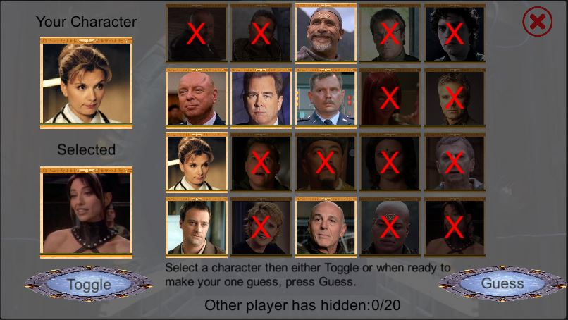

# Guess Who Stargate Edition
 
This project is a multiplayer game designed to work with mobile and PC developed in Unity with a NodeJS server. The game requires users can speak or communicate independently to the game. 

Note that to use this application yourself, you will need to host the NodeJS server somewhere and modify the NetworkManger.js by changing the serverURL variable to point to your server.

* NodeJS Server pairing with this project: ([Github Link](https://github.com/Squirrelbear/StargateGuessWho-NodeJSServer))

# Example of the Game

When first opening the game, you will see a view similar to what is shown below. At any time, you can press the X in the top right corner to quit, return to this start menu, or hide the dialog that appears.

Pressing Start Game will bring you to the Join or Create screen, as shown below. You will always need to enter a valid name with between 3 to 20 alphanumeric characters. Instead of a tick, any invalid name will show an X on the right. If joining an existing server, the other player who created the server will have a five-digit random code consisting of capital letters. Entering a code is only relevant if clicking on the “Join Session” button. After clicking the “Create Session” button, the user would be taken to a screen where they await another player joining using a matching random code displayed to the session creator. 

Assuming everything is valid, both players are taken straight into the game. The view below shows the individual view of the main game screen. The user is initially presented with a faded out “Choose” button because they need to press on a character to select a target first or use “Random” to select randomly.

After selecting a character, it is displayed in the bottom left, and the “Choose” button can be pressed. This button will lock in that character as the character for that player for the round. The view of characters is entirely individual for each player.

Below, the view after selecting a character is shown, with the top box now filled. You can keep changing characters up until both players have made a choice. You will also notice that in this image, the UI has changed from the “Choose” and “Random” to show “Toggle” and “Guess”. These work in the same way as the “Choose” button did. You simply select characters, and then toggling will mark them as eliminated (or not), and guess will lock in your one attempt at choosing who the other player has chosen as their character.

You can see an example of what the toggled characters appear like in the view below. In this case, the player may have asked the other player “if their chosen character is a friend of Earth”. So the player has toggled all the characters that were not an ally of Earth. The bottom text will show the number of characters the other player has hidden. This information lets you know how close the other player may be to solving the selected character.

This next image shows an example of the game state after the player has asked if the character “has been a member of SG1”. Therefore, eliminating all the SG1 characters.

The next image shows an example of asking if the character “is a general”, leaving only three options remaining.

Once the other player makes a guess, the number of hidden characters changes to show the text saying, “Other player has made a guess”. The player whose view is shown in the screenshot then decides to guess if the other player’s character is General West by selecting the character and pressing “Guess”.

In this case, it turned out to be correct. Once both players have provided a guess, they are taken to the post-game screen, as seen below. Showing whether it was a win, loss, or draw along with the score. It is considered a draw if both players guess incorrectly or guess correctly. When ready, each player can press “Next”, and they are returned to choosing a character again, and the process repeats.

